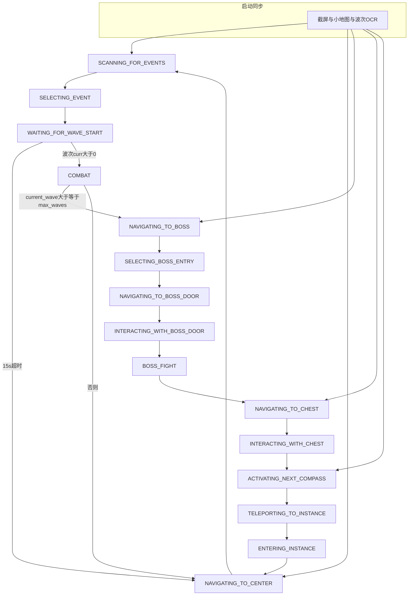

# diablo4Helper 项目逻辑与行为动线

| 字段 | 说明 |
|------|------|
| 文档版本 | 1.0 |
| 最后同步代码 | 2026-03-29（与仓库内 `core/`、`config.py`、`main.py` 对照） |

本文描述**实现层面**的流程、状态机与模块职责；面向用户的使用说明见仓库根目录 [README.md](../README.md)。

---

## 1. 项目定位与依赖

- **目标**：在固定分辨率（默认 2560×1440）下，通过截图 + OpenCV 模板匹配 + EasyOCR，驱动键鼠完成「罗盘副本」从开罗盘、进本、波次事件、战斗、首领、开箱拾取到再开罗盘的循环。
- **入口**：[`main.py`](../main.py) 选择语言 → 构造 `CompassBot` → `run()`。
- **主要依赖**：见 [`requirements.txt`](../requirements.txt)（OpenCV、PyAutoGUI、EasyOCR、`keyboard`、NumPy、PyTorch 等）。`VisionSystem` 中 EasyOCR 默认 `gpu=True`；无 CUDA 环境时需改代码或安装对应 GPU 驱动与 PyTorch。

---

## 2. 目录与模块职责

| 层次 | 路径 | 职责 |
|------|------|------|
| 入口 | `main.py` | 语言 `en` / `cn`，异常与 Ctrl+C 提示 |
| 编排 | `core/agent.py` | `CompassBot`：状态机、断点同步、弹窗确认、导航闭环、开箱与拾取子流程 |
| 视觉 | `core/vision.py` | 小地图/全屏截图、模板加载与匹配、ROI 内匹配、EasyOCR 扫字、波次/以太解析、调试图写入 `logs/` |
| 操作 | `core/navigation.py` | WASD 按住时长移动、鼠标移动/点击、战斗巡逻 `patrol_circular`、技能键 2/3/4、可选录制回放 |
| 配置 | `config.py` | ROI、容差、事件优先级列表、资源路径、`LOGS_DIR` 等 |
| 枚举 | `core/enums.py` | `GameState` 全集 |
| 文案 | `assets/translations.json` | 中英日志与提示 |
| 模板图 | `assets/*.png` | 小地图图标、弹窗、宝箱提示、混沌事件图等 |
| 校验脚本 | `verify/*.py` | 各环节独立验证 |
| 校准/分析 | 根目录 `calibrate_*.py`、`analyze_*.py`、`debug_capture.py` 等 | 调 ROI 或分析截图，**不随主流程自动运行** |

---

## 3. 启动与用户动线

1. 运行 `python main.py`，输入 `1`（英文）或 `2`（中文）。
2. `CompassBot.__init__`：加载翻译、创建 `VisionSystem` / `NavigationSystem`、`load_assets()` 注册全部模板。
3. `run()`：打印 `start_prompt`，等待 3 秒；截全屏、截小地图、`read_wave_number()`。
4. **断点同步**（仅决定**初始** `GameState`，见下节分支表）。
5. 进入 `while True` 主循环：按当前状态执行；在部分状态下刷新波次 OCR。

---

## 4. 初始状态同步（`run()` 开头）

逻辑在 `agent.py` 的 `run()` 内，顺序如下：

| 条件 | 初始状态 |
|------|-----------|
| 波次 OCR 像「副本内」（元组 `curr/total`，或字符串含 `波` / `Wave` / `/`），且 `EVENT_SCAN_ROI` 内 OCR 能 `fuzzy_match_event` 任一条 | `SCANNING_FOR_EVENTS` |
| 同上「像副本内」，但没有任何可匹配事件 | `NAVIGATING_TO_CENTER` |
| 小地图匹配 `bosshand` 或 `bossdoor` | `NAVIGATING_TO_BOSS` |
| 小地图匹配 `chest_marker`（资源为 `icon_health.png`，作血井/站位参照） | `NAVIGATING_TO_CHEST` |
| 以上皆否（默认视为城镇） | `ACTIVATING_NEXT_COMPASS` |

随后将 `current_wave`、`max_waves` 重置为 0 / 10（波次会在循环内由 OCR 再更新）。

---

## 5. 状态机总览

---

## 6. 各状态行为摘要

### 6.1 波次与事件

- **`NAVIGATING_TO_CENTER`**：鼠标移屏幕中心，`execute_return_to_center(template_name="bonehand")`，成功 → `SCANNING_FOR_EVENTS`。
- **`SCANNING_FOR_EVENTS`**：优先全屏（相对 EVENT ROI）OpenCV 匹配 `hundun_event`（阈值 0.7）；命中则直接构造混沌事件目标 → `SELECTING_EVENT`。否则 EasyOCR 扫描 `EVENT_SCAN_ROI`，过滤 UI 提示词；若出现「理事会 / 巴图克 / Council / Barthuk」类文案 → 切到 `SELECTING_BOSS_ENTRY`。其余经 `fuzzy_match_event` 与 `select_best_event`（顺序由 `config.DESIRED_EVENTS_CN` / `DESIRED_EVENTS_EN`）选出最佳 → `SELECTING_EVENT`；无结果则 sleep 重试。
- **`SELECTING_EVENT`**：点击 `selected_event_target` 中心 → `WAITING_FOR_WAVE_START` 并记录时间。
- **`WAITING_FOR_WAVE_START`**：超过 15 秒 → 回 `NAVIGATING_TO_CENTER`；否则循环内若波次 OCR 为 `(curr, total)` 且 `curr > 0` → `COMBAT`。
- **`COMBAT`**：`patrol_circular(duration=60)`；若已是最后一波 → `NAVIGATING_TO_BOSS`，否则 → `NAVIGATING_TO_CENTER`。

### 6.2 首领链

- **`NAVIGATING_TO_BOSS`**：`execute_return_to_center("bosshand")` → `SELECTING_BOSS_ENTRY`。
- **`SELECTING_BOSS_ENTRY`**：`read_ether_count()`：若 **以太 > 1066** → 点击文案「巴图克」/「Barthuk」，否则「理事会」/「Council」。**若以太读取失败**：代码最终把 `target_text` 设为理事会 / Council（与中间一行注释意图不一致，以当前代码为准）。全屏 OCR 找 `target_text` 并点击 → `NAVIGATING_TO_BOSS_DOOR`。
- **`NAVIGATING_TO_BOSS_DOOR`**：`execute_return_to_center("bossdoor")`，可对 `bossdoor_merge` 做容差内成功判定 → `INTERACTING_WITH_BOSS_DOOR`。
- **`INTERACTING_WITH_BOSS_DOOR`**：鼠标移到屏幕上区，OCR 匹配「议会大门」类关键词后点击；成功则写 `logs/door_openings.log` → `BOSS_FIGHT`。
- **`BOSS_FIGHT`**：向上移动 6s，约 10s 内 `cast_skills()` → `NAVIGATING_TO_CHEST`。

### 6.3 宝箱与回城

- **`NAVIGATING_TO_CHEST`**：`execute_return_to_center("chest_marker")`，血井模板相对玩家中心目标偏移为代码中的 **`(12, 111)`** 像素（校准值）→ `INTERACTING_WITH_CHEST`。
- **`INTERACTING_WITH_CHEST`**：自屏幕中心向上扫描鼠标，用 `tip_bosschest` 或 OCR（强效 / Greater / Chest / Spoils 等）找交互点；命中后纵坐标上移 65px（带边界保护），**F 键**交互。随后在竖条 ROI 内最多 **30s**：周期性 **Alt** + 在 ROI 内匹配 `tip_huifu`、`icon_taigu_tag` 并左键拾取。结束后 **T** 键、等待 → `ACTIVATING_NEXT_COMPASS`。

### 6.4 城镇：下一罗盘与进本

- **`ACTIVATING_NEXT_COMPASS`**：`I` 开背包；`INVENTORY_REGION` 内找钥匙栏模板或 OCR「钥匙」；点击后找 `compass` 右键；`handle_modal_accept("modal_usekey")` 点「接受」→ 关背包 → `TELEPORTING_TO_INSTANCE`。
- **`TELEPORTING_TO_INSTANCE`**：`Tab`，找 `compass_door`，点击后 `handle_modal_accept("modal_tp")`；等待后 `compass_count += 1`，波次清零 → `ENTERING_INSTANCE`。
- **`ENTERING_INSTANCE`**：`execute_return_to_center("start_icon", tolerance=10)`；在 15s 内等小地图出现 `bonehand` 或 `extrahand` → `NAVIGATING_TO_CENTER`；超时亦进入 `NAVIGATING_TO_CENTER`。若 start 图标导航失败则盲移向上并再检测小地图图标。

### 6.5 其他

- **`IDLE`**：主循环中仅 sleep，正常流程很少从此开始。
- **`GameState.LOOTING`**：在 `enums.py` 中定义，**当前 `run()` 未切换到该状态**；拾取逻辑内嵌在 `INTERACTING_WITH_CHEST`。

---

## 7. 导航核心：`execute_return_to_center`

- 在小地图 `MINIMAP_REGION` 内找模板，与 `config.PLAYER_POS` 比较偏移。
- **非 chest**：优先 `extrahand`，否则 `bonehand`；若调用时指定 `bossdoor` 等则回退到对应模板；`bossdoor` 可对 `bossdoor_merge` 做「已在容差内」直接成功。
- **chest_marker**：灰度多峰值匹配，多候选时选与目标偏移 `(12, 111)` 曼哈顿距离最小者。
- 误差大于容差则 `nav.move` 分轴修正；步数上限 `MAX_STEPS`；移动时长由 `navigation.calculate_duration` 按像素差分档。

---

## 8. 视觉与 OCR 要点（`vision.py`）

- **波次** `read_wave_number()`：截取 `WAVE_REGION`，解析 `n/m` 且 `m ∈ {8,10}` 等规则；失败可能返回原始字符串或 `None`。
- **以太** `read_ether_count()`：截取 `ETHER_REGION`，合并 OCR 文本取数字。
- **扫字** `scan_screen_for_text_events`：ROI 裁剪、灰度、1.5× 放大后 EasyOCR，`prob < 0.2` 丢弃。
- **模板** `find_template` / `find_template_in_region`：灰度 `TM_CCOEFF_NORMED`，返回中心点与得分。

---

## 9. 配置与校准依赖（`config.py`）

- **分辨率敏感**：`MINIMAP_REGION`、`PLAYER_POS`、`WAVE_REGION`、`ETHER_REGION`、`EVENT_SCAN_ROI`、`INVENTORY_REGION` 等均按 2560×1440 标定；改分辨率须重标定并**同步更新本文档**。
- **玩法相关**：`DESIRED_EVENTS_CN` / `DESIRED_EVENTS_EN` 决定事件优先级；`MATCH_THRESHOLD`、`CENTER_TOLERANCE`、`BOSS_DOOR_TOLERANCE`、`CHEST_TOLERANCE`、`MAX_STEPS` 影响导航与识别稳定性。

---

## 10. 日志与调试

- 控制台：`log_status` 带罗盘序号、波次、以太占位。
- 文件：`logs/door_openings.log`；多种 `debug_*.png` 写入 `logs/`（如宝箱点击、拾取 ROI、弹窗失败等）。
- `UNKNOWN_EVENTS_DIR` 等目录在 `config.py` 中创建，供未知事件类扩展使用。

---

## 11. 辅助脚本索引（主流程不调用）

| 类型 | 示例文件 | 用途（概要） |
|------|-----------|----------------|
| 验证 | `verify/verify_*.py` | 小地图、事件区、拾取、Boss 门等单点验证 |
| 校准 | `calibrate_center.py`、`calibrate_v2.py`、`calibrate_chest.py` | 中心/宝箱等位置标定 |
| 分析 | `analyze_*.py`、`analyze_reference*.py` | 截图统计分析 |
| 调试 | `debug_capture.py`、`check_colors.py` | 抓屏与颜色检查 |

---

## 12. 文档维护约定

修改 `core/agent.py`、`core/vision.py`、`core/navigation.py`、`core/enums.py`、`config.py` 中**影响流程、状态、ROI、阈值或对外行为**的逻辑时，应同步更新本文件，并递增「文档版本」、更新「最后同步代码」日期。
